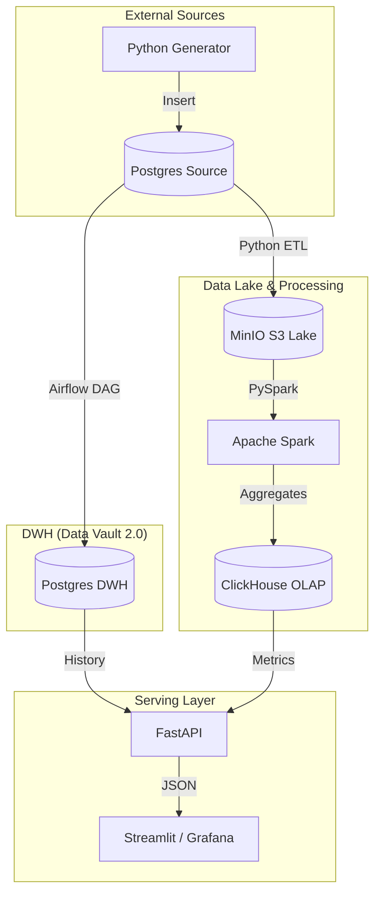
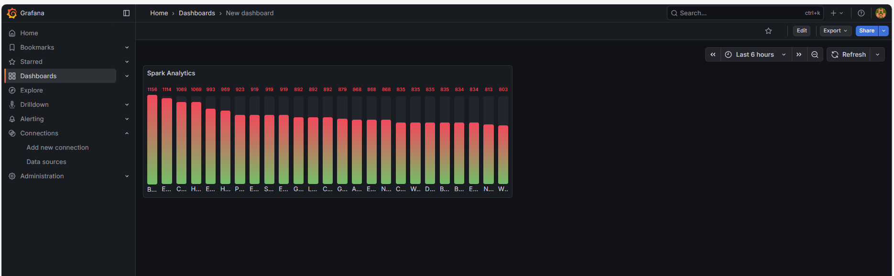
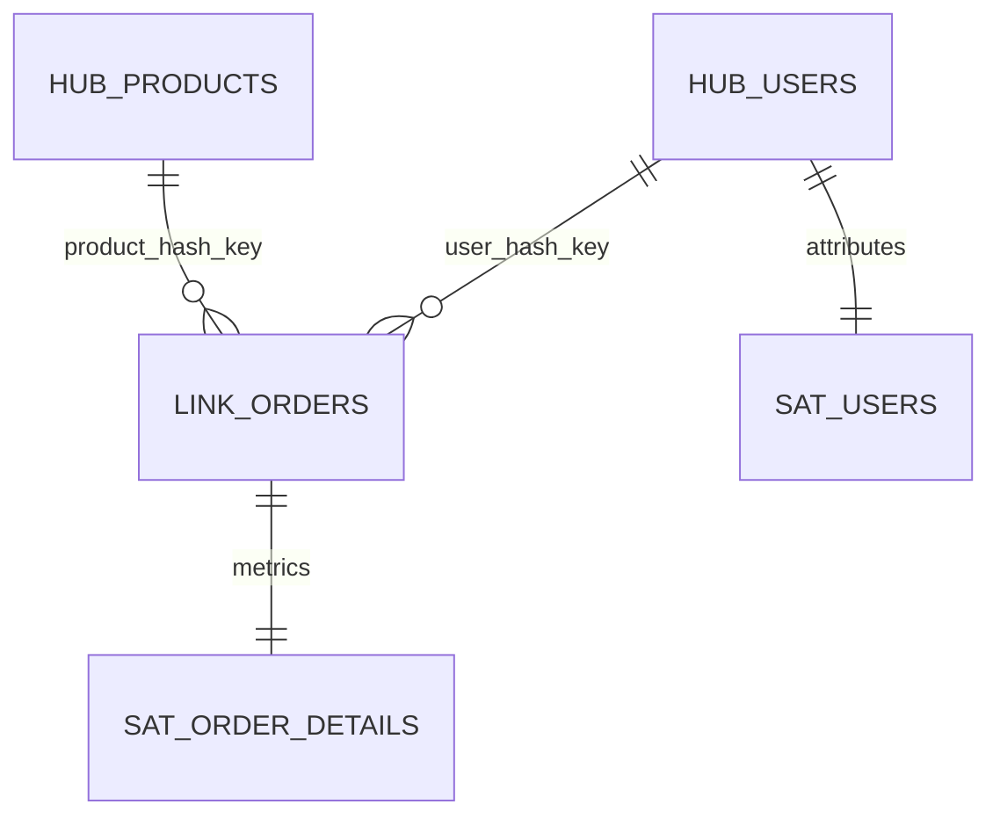

# End-to-End Hybrid Data Platform (Lambda Architecture)

Спроектированная и реализованная с нуля платформа сбора, хранения и анализа данных об интернет-заказах. Проект демонстрирует принципы работы современных Data Lake и DWH решений.

## 🏗 Архитектура
Проект построен на принципах **Lambda Architecture**:
- **Batch Layer (Spark):** Тяжелая обработка исторических данных в формате Parquet.
- **Speed Layer (Airflow + Redis):** Оперативный расчет метрик (Revenue) "на лету".
- **Serving Layer (FastAPI):** Единая точка доступа к данным для фронтенда.


### Архитектура проекта



### Технологический стек:
- **Оркестрация:** Apache Airflow
- **Обработка данных:** Apache Spark (PySpark)
- **Хранилище (DWH):** PostgreSQL (Data Vault 2.0 methodology)
- **OLAP:** ClickHouse
- **Data Lake:** MinIO (S3 compatible)
- **Кэш:** Redis
- **Визуализация:** Grafana, Streamlit
- **Инфраструктура:** Docker, Docker Compose

## 📊 Визуализация данных (Grafana)
На дашборде отображаются результаты работы Spark-аналитики: средний чек в зависимости от города проживания пользователя.



## 🚀 Как запустить
1. Клонируйте репозиторий.
2. Создайте файл `.env` и добавьте туда `TELEGRAM_TOKEN`.
3. Запустите платформу:
   ```bash
   docker-compose up -d --build
4. Запустите генератор данных:
    python generator.py


### 📊 Ключевые фичи
    Data Vault 2.0: Гибкая модель данных с Hubs, Links и Satellites.
    Compaction: Оптимизация хранения путем конвертации сырых JSON в сжатый Parquet через Spark.
    Monitoring: Уведомления о статусе ETL-процессов в Telegram.
    Real-time API: FastAPI эндпоинты для получения горячих данных из Redis.
    text

### Модель данных (Data Vault 2.0)

